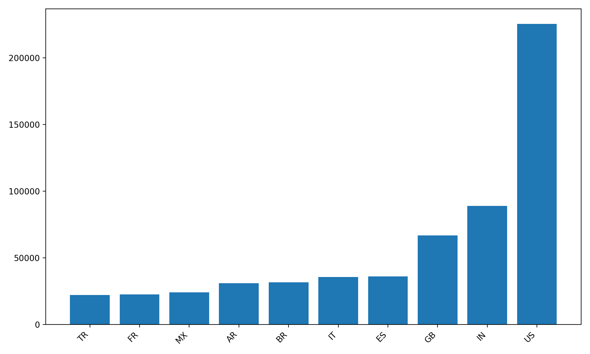
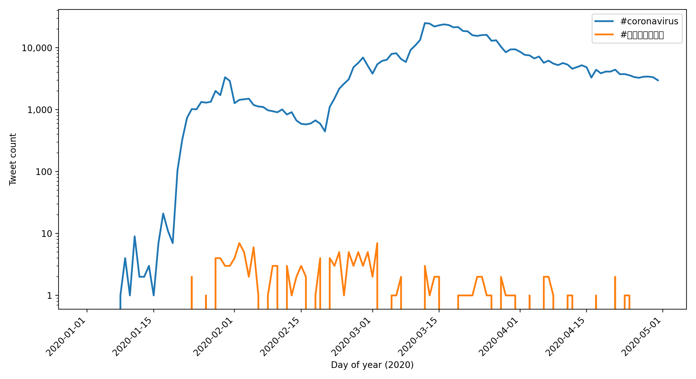

# Coronavirus Twitter MapReduce Analysis

## Project Overview
This project analyzes ~1.1 billion geotagged tweets from 2020 to study how discussion of COVID-19 spread across languages, countries, and time.

Because the dataset is too large for traditional analysis, I implemented a parallel MapReduce pipeline in Python + Bash on a multi-processor server.

- **Mapper:** scans each day of tweets and counts hashtag usage by **language** and **country**
- **Reducer:** aggregates all daily outputs into global totals
- **Visualization:** generates plots for the top 10 languages/countries and a time-series over 2020

## Results

## Coronavirus Top Languages With English #coronavirus

## Coronavirus Top Countries With English #coronavirus 

## Korean Hashtag Top Language 

## Korean Hashtag Top Country

## Hashtag Usage Over Time (2020)

- The blue line represents the English hashtag (#coronavirus), while the orange line represents the Korean hashtag (#코로나바이러스).

