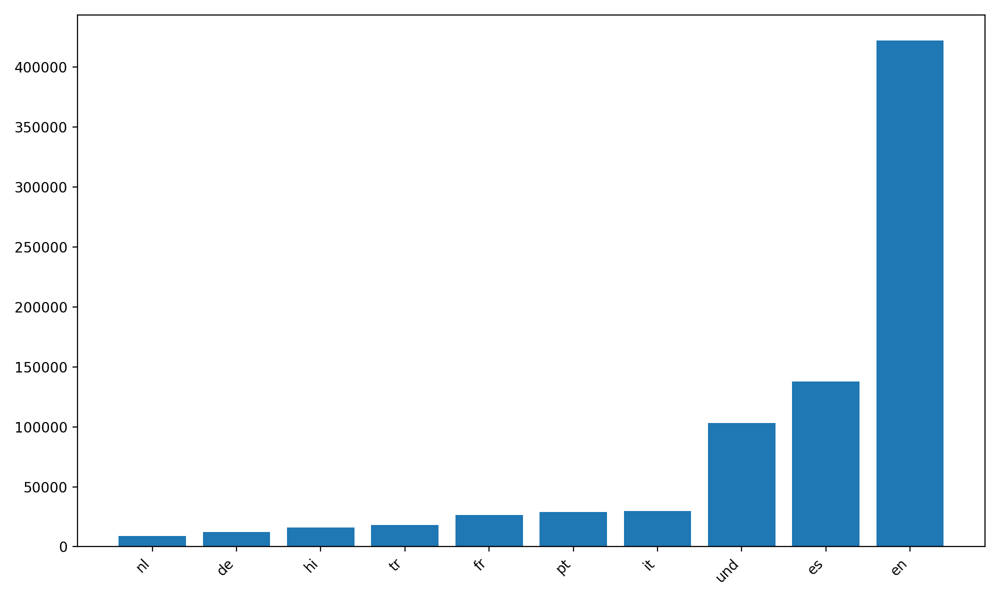
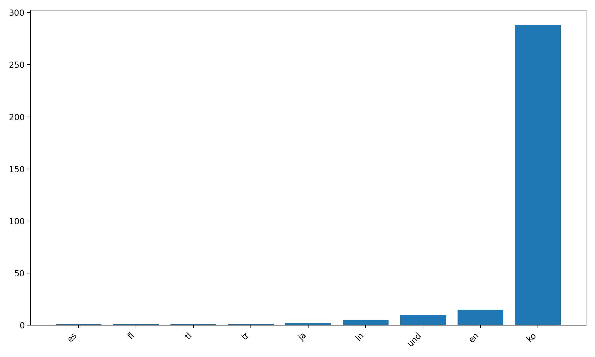
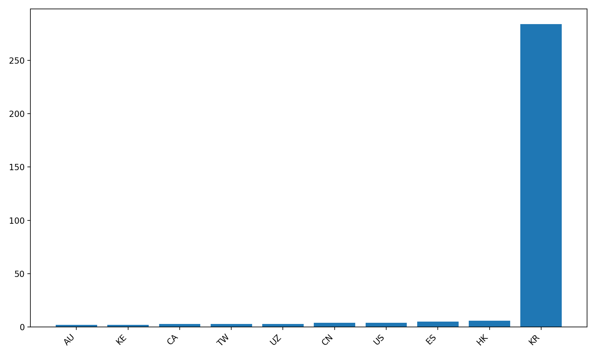

# Twitter Coronavirus MapReduce Analysis

This project analyzes geotagged Twitter posts from 2020 using a MapReduce pipeline in Python. The project tracks hashtag usage across multiple languages and countries to monitor global discussion surrounding COVID-19.

## Technologies
- Python
- MapReduce
- JSON
- matplotlib
- Linux shell scripting

## Coronavirus Language Analysis

## Coronavirus Country Analysis

## Korean Hashtag Language Analysis

## Korean Hashtag Country Analysis

